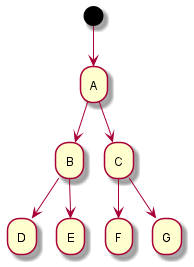
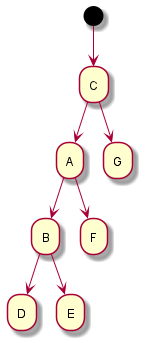
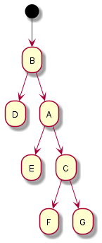
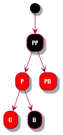
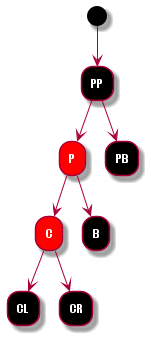
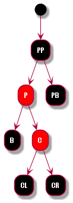
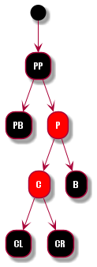
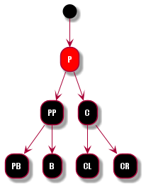

红黑树： 是一个二叉查找树， 在平衡二叉树的高效查找速率和低速插入删除速率的折中。

特性：  
1、每个节点必须是红色或者黑色  
2、根节点必须是黑色  
3、每个叶子节点(null)是黑色  
4、每个红色节点的子节点必是黑色  
5、从一个节点到该节点的子孙叶子节点的所有路径上包含相同数目的黑色节点
 
参考HashMap 中红黑树的实现

一、左旋和右旋操作：  
左旋和右旋是 不改变二叉查询数的特性的情况下，对二叉树进行调整

| 情况 | 原图 | 旋转图 | 
| :----: | :----: | :----: | 
| 左旋 |   |  |
| 右旋 |  | |

 
二、添加节点操作：  
1、找到要插入的的节点位置
2、插入一个节点为红色的节点  
上面两步保证了节点的 “特性5”， 但是可能会破坏 “特性2” 或 “特性4”.

情况1： 破坏“特性2”时，直接将 当前节点设置为黑色即可  
情况2： 破坏“特性4”时，即变化节点(C) 与 其父节点(P) 的颜色都是红色，  将情况列表分析   
设定： 父节点的兄弟节点为 PB， 父节点的父节点为 PP, 变化节点的左节点为 CL, 变化节点的右节点为 CR

| 情况 | 情况示意图 | 旋转示意图 | 说明 | 
| :----: | :----: | :----: | :----: | 
| PB为红色 |   | -0.png) |  |
| PB为黑色, P为PP的左节点, C为P的左节点 |   | -0.png) |  |
| PB为黑色, P为PP的左节点, C为P的右节点 |   |  -0.png)   -0.png)|  |
| PB为黑色, P为PP的右节点, C为P的左节点 |  | -0.png)   -0.png)  |  |
|  PB为黑色, P为PP的右节点, C为P的右节点 |  | -0.png) |  |

三、删除节点操作：

